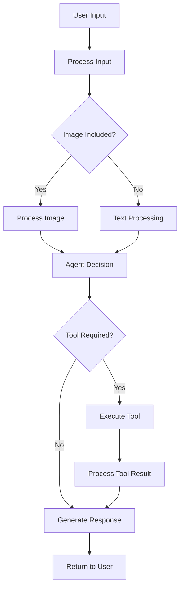

# 🌍 AI Travel Assistant

An advanced, multi-modal travel assistant powered by LangChain, LangGraph, and RAG (Retrieval-Augmented Generation) technology. This intelligent agent can help you plan trips, book flights and hotels, provide destination information, and even understand travel images.

## ✨ Features

### 🔍 **Comprehensive Travel Knowledge**
- **Wikipedia Integration**: Access to extensive travel information from Wikipedia
- **RAG-powered Search**: Intelligent retrieval of relevant travel information
- **Destination Intelligence**: Detailed information about attractions, culture, and travel tips
- **Custom Travel Database**: Pre-loaded with practical travel tips and local insights

### ✈️ **Flight Services**
- **Flight Search**: Find flights by airport codes, cities, or names
- **Flight Booking**: Book flights with seat preferences
- **Booking Management**: Cancel existing flight bookings
- **Flexible Search**: Search by departure/arrival times, airports, and cities

### 🏨 **Hotel Services**
- **Hotel Search**: Find hotels by location, rating, and amenities
- **Text-based Search**: Natural language hotel search
- **Hotel Booking**: Reserve rooms with check-in/check-out dates
- **Detailed Information**: Get comprehensive hotel details
- **Booking Management**: Cancel hotel reservations

### 🖼️ **Multi-modal Capabilities**
- **Image Understanding**: Analyze travel images for destination inspiration
- **Visual Travel Planning**: Get recommendations based on images
- **BLIP Integration**: Advanced image captioning for context understanding

### 🧠 **Intelligent Agent Architecture**
- **LangGraph Framework**: Sophisticated agent workflow management
- **Tool Integration**: Seamless integration of multiple travel tools
- **Memory Management**: Maintains conversation context
- **Error Handling**: Robust error management and fallback mechanisms

## 🚀 Getting Started

### Prerequisites

1. **Python 3.8+** installed on your system
2. **Required API Keys**:
   - Groq API key (for LLM)
   - LiteAPI Travel key (for hotel services)
3. **Database Setup**: Run `flight_db.py` first to create the flight database

### Installation

1. **Clone the repository**:
   ```bash
   git clone <repository-url>
   cd travel-assistant
   ```

2. **Install dependencies**:
   ```bash
   pip install -r requirements.txt
   ```

3. **Set up the flight database**:
   ```bash
   python flight_db.py
   ```
   This creates the `flight.sqlite` database with sample flight data.

4. **Configure API keys**:
   - Set up your Kaggle secrets or environment variables:
     - `groq_api_key`: Your Groq API key
     - `liteApi_key`: Your LiteAPI Travel key

### Required Dependencies

```txt
langchain-core
langchain-groq
langchain-community
langgraph
faiss-cpu
sentence-transformers
transformers
torch
PIL
requests
kaggle
sqlite3
pickle
numpy
pandas
```

## 🔧 Configuration

### API Keys Setup

The application uses Kaggle secrets for API key management. You can modify the code to use environment variables:

```python
# Replace kaggle secrets with environment variables
os.environ["GROQ_API_KEY"] = "your_groq_api_key"
os.environ["LITEAPI_KEY"] = "your_liteapi_key"
```

### Database Configuration

The application automatically creates a SQLite database for flights. The schema includes:

- Flight details (number, airline, aircraft)
- Airport information (IATA codes, names, cities)
- Schedule information (departure/arrival times)
- Flight status

## 🛠️ Usage

### Basic Usage

```python
from travel_assistant import app, process_user_input

# Simple text query
inputs = {"messages": [HumanMessage(content="Find hotels in Paris")]}
response = app.stream(inputs, stream_mode="values")

# Multi-modal query with image
state = process_user_input(
    "I want to visit a place like this", 
    image_input=your_image_data
)
response = app.stream(state, stream_mode="values")
```

### Example Queries

#### 🏨 Hotel Search
```python
"Find luxury hotels in Mumbai with pool and gym"
"Book a hotel in Delhi for 2 people from June 10 to June 15"
"Cancel my booking at Grand Palace Hotel"
```

#### ✈️ Flight Search
```python
"Search flights from Delhi to Mumbai"
"Book flight AI101 from DEL to BOM for 2 passengers"
"Cancel my flight booking for flight AI101"
```

#### 🌍 Travel Information
```python
"What are the top attractions in Jaipur?"
"Tell me about Kerala's culture and best time to visit"
"What are the baggage rules for domestic flights in India?"
```

#### 🖼️ Image-based Queries
```python
# With image input
"I saw this beautiful place online. Can you help me find similar destinations?"
"Plan a trip to places that look like this image"
```

## 🔍 Available Tools

### Flight Tools
- **FlightSearch**: Search flights by various criteria
- **FlightBooking**: Book flight tickets
- **CancelFlightBooking**: Cancel existing bookings

### Hotel Tools
- **HotelSearch**: Search hotels by location and criteria
- **HotelTextSearch**: Natural language hotel search
- **BookHotel**: Reserve hotel rooms
- **CancelBooking**: Cancel hotel reservations
- **HotelDetail**: Get detailed hotel information

### Knowledge Tools
- **TravelKnowledgeSearch**: Search comprehensive travel knowledge base
- **DestinationInfo**: Get detailed destination information

## 📊 Data Sources

### Wikipedia Integration
The system loads travel-related Wikipedia articles covering:
- **Indian Destinations**: Delhi, Mumbai, Bangalore, Goa, Kerala, Rajasthan
- **International Destinations**: Paris, London, New York, Tokyo, Dubai
- **Travel Topics**: Visa policies, airlines, railways, travel tips
- **Cultural Information**: Indian cuisine, culture, languages

### Custom Travel Database
Pre-loaded with practical information:
- Baggage rules and regulations
- Budget travel tips
- Safety and health recommendations
- Popular travel circuits and routes

## 🏗️ Architecture

### Agent Workflow


### Memory Management
- **Conversation Buffer**: Maintains chat history
- **Vector Store**: Persistent storage for travel knowledge
- **Booking State**: In-memory storage for active bookings

## 🔐 Security & Privacy

- **API Key Protection**: Secure handling of API credentials
- **Data Validation**: Input sanitization and validation
- **Error Handling**: Comprehensive error management
- **Thread Safety**: Thread-safe database operations

## 📝 Logging

The application creates detailed logs in `travel_assistant_log.txt` including:
- User queries and responses
- Tool executions and results
- Error messages and debugging information

## 🤝 Contributing

1. Fork the repository
2. Create a feature branch
3. Make your changes
4. Add tests if applicable
5. Submit a pull request

## 📄 License

This project is licensed under the MIT License - see the LICENSE file for details.

## 🆘 Support

For issues and questions:
1. Check the logs in `travel_assistant_log.txt`
2. Verify your API keys are correctly configured
3. Ensure the flight database is properly created
4. Check that all dependencies are installed

## 🔄 Updates & Maintenance

### Regular Updates
- **Vector Store**: Rebuilds automatically if not found
- **Wikipedia Data**: Periodically update travel information
- **API Integration**: Monitor API changes and update accordingly

### Performance Optimization
- **Chunking Strategy**: Optimized text splitting for better retrieval
- **Caching**: Vector store persistence for faster startup
- **Thread Safety**: Concurrent request handling

## 📚 Additional Resources

- [LangChain Documentation](https://langchain.readthedocs.io/)
- [LangGraph Guide](https://langchain-ai.github.io/langgraph/)
- [LiteAPI Travel Documentation](https://docs.liteapi.travel/)
- [Groq API Documentation](https://docs.groq.com/)

---

**Happy Travels! 🌟**